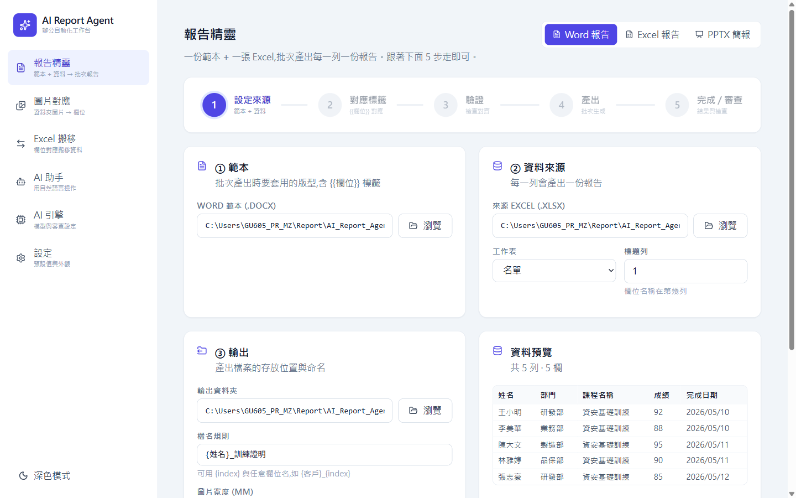

# 🤖 AI Report Agent

> 一份範本 + 一張 Excel,**批次產出每列一份報告**(Word / Excel / PPTX)。
> 還有 **AI 助手**:用中文一句話交辦,Agent 自己看設定、對應標籤、驗證、產出 —— 不必一步步點。




## ✨ 特色

- 📄 **批次報告**:Word / Excel / PPTX 範本 × Excel 資料,一列一份、自動命名
- 🏷️ **視覺化標籤對應**:點欄位 → 點位置插入;或讓 AI 一鍵建議(連無標籤範本也能自動補)
- 🤖 **AI 助手**:中文一句話交辦,Agent 自動驗證 + 產出,卡關會主動問你
- 🖼️ **圖片自動配置**:依檔名 / 版面把照片放進報告
- ✅ **AI 審查**:產出後逐份用視覺模型評分,不合格自動分流
- 🔒 **本機執行**:資料不外流;可用本機 Ollama 免雲端,或接 Google Gemini

## 🚀 快速開始

```bash
# 1) 安裝後端依賴(擇一)
uv sync                                          # 方式一:uv,依 .python-version 自動裝對的 Python
# 方式二(pip):py -3.13 -m venv .venv
#              .venv\Scripts\python -m pip install -r backend\requirements.txt

# 2) 啟動:雙擊 launch.bat → 瀏覽器開 http://127.0.0.1:8756
```

> 📖 **完整圖文操作手冊** → [`docs/AI_Report_Agent_操作SOP.pdf`](docs/AI_Report_Agent_操作SOP.pdf)(每個畫面截圖 + 紅框標註 + 步驟)

---

原 `AI-`(customtkinter 桌面工具)的**前端重構版**:把混亂的多分頁介面,改成一條**看得見的報告流水線**。後端沿用既有報告引擎,前端改用 React 視覺化呈現。

> 📖 **完整使用說明(手動操作 + Agent 操作,逐步圖解)→ [`docs/USAGE.md`](docs/USAGE.md)**
> 第一次使用、或想知道某個功能怎麼點/怎麼用中文叫 Agent 做,請看那份。本 README 只談架構與啟動。

## 為什麼重構

舊版把「製作報告」拆在 6 個並列分頁,使用者看不出先做什麼、在哪一步。新版把核心流程變成 5 步精靈:

```
① 設定來源 → ② 對應標籤 → ③ 驗證 → ④ 產出 → ⑤ 完成/審查
```

每一步都有即時預覽與「現在在做什麼/下一步」的引導。

## 架構

```
AI_Report_Agent/
├─ backend/              FastAPI 本機服務(port 8756)
│  ├─ app/               移植自 AI- 的報告引擎(generator / excel_template /
│  │                     excel_transfer / filename / settings / agent 子系統)
│  ├─ headless_context.py  無 Tk 版 AppContext(agent 與 REST 共用狀態)
│  ├─ native_dialog.py   原生 OS 檔案選取對話框
│  ├─ server.py          API + WebSocket + 靜態前端服務
│  └─ static/            前端 build 輸出(由 FastAPI 直接服務)
├─ frontend/             Vite + React + TS + Tailwind
└─ launch.bat            一鍵啟動(開後端 + 瀏覽器)
```

- **後端**:重用原 `app/` 邏輯,零修改。狀態存在 `~/.auto_report/settings.json`(與舊桌面版共用)。
- **前端**:單頁 SPA,build 後由後端同源服務,不需額外 Node 伺服器。

## 功能(與舊版對等)

| 畫面 | 內容 |
|---|---|
| 報告精靈 | Word / Excel 兩種報告;視覺化標籤編輯器(點欄位→點位置插入)+ AI 建議對應;驗證;SSE 即時產出進度;審查結果 |
| Excel 搬移 | 欄位對應(自動對應同名)、三種寫入模式 |
| AI 助手 | 自然語言操作(WebSocket 串流);沿用原 agent 工具與 orchestrator |
| AI 引擎 | Gemini / Ollama 模型選擇、審查設定、呼叫預算 |
| 設定 | 預設值、圖片寬度、熱鍵橋接目標 |

## 安裝(後端依賴)

本專案有**自己的隔離環境**,不再依賴其他專案。兩種方式擇一,結果都會建出專案根目錄的 `.venv`,`launch.bat` 通用。

### 方式一:uv(建議,免煩惱 Python 版本)

[uv](https://docs.astral.sh/uv/) 會依 `.python-version` **自動下載對的 Python(3.13)** 並安裝鎖定版依賴,使用者不會踩到「Python 版本不對」的坑。

```
:: 先裝 uv(只需一次):https://docs.astral.sh/uv/getting-started/installation/
::   PowerShell: powershell -ExecutionPolicy ByPass -c "irm https://astral.sh/uv/install.ps1 | iex"
uv sync
```

### 方式二:傳統 pip

需要本機已有 Python 3.11+(建議 3.13)。

```
py -3.13 -m venv .venv
.venv\Scripts\python -m pip install -r backend\requirements.txt
```

> 依賴清單同時維護於 `pyproject.toml`(uv 讀)與 `backend/requirements.txt`(pip 讀),兩者內容保持一致;改動其一請同步另一個。

### 前端

前端已 build 進 `backend/static`,**一般使用者免裝 Node**。只有要改前端原始碼才需要:

```
cd frontend
npm install
```

## 啟動

### 一鍵(正式版)
```
launch.bat
```
用專案 `.venv` 的 Python 跑後端,並開瀏覽器到 http://127.0.0.1:8756。
**只有一個程序**:後端同時供應 API 與已 build 的前端網頁。前端錯誤看瀏覽器 F12 Console,後端錯誤看那個命令視窗。

### 開發模式(前端熱更新)
```
:: 終端機 1 — 後端
.venv\Scripts\python.exe backend\server.py
:: 終端機 2 — 前端 dev server(會 proxy /api 與 WebSocket 到後端)
cd frontend
npm run dev
```
然後開 http://127.0.0.1:5275

### 改前端後重新 build
```
cd frontend
npm run build      :: 輸出到 backend/static,launch.bat 即吃到新版
```

## 設定 API key

把 `GEMINI_API_KEY` 放在專案根目錄的 `.env`(參考 `.env.example`,不進版控)。
用本機 Ollama 則免 key,走 `OLLAMA_ENDPOINT`(預設 `http://localhost:11434`)。

## 注意

- **熱鍵橋接(Ctrl+Shift+M)** 需要本機 Office(COM),為進階功能;在「對應標籤」步驟用滑鼠即可完成相同的事。
- **AI 審查 / docx 預覽** 需要本機安裝 Word(透過 COM 轉 PDF)。
- `pywin32`(COM 相關)僅 Windows 安裝;非 Windows 平台這些進階功能不可用,核心報告產出仍正常。
